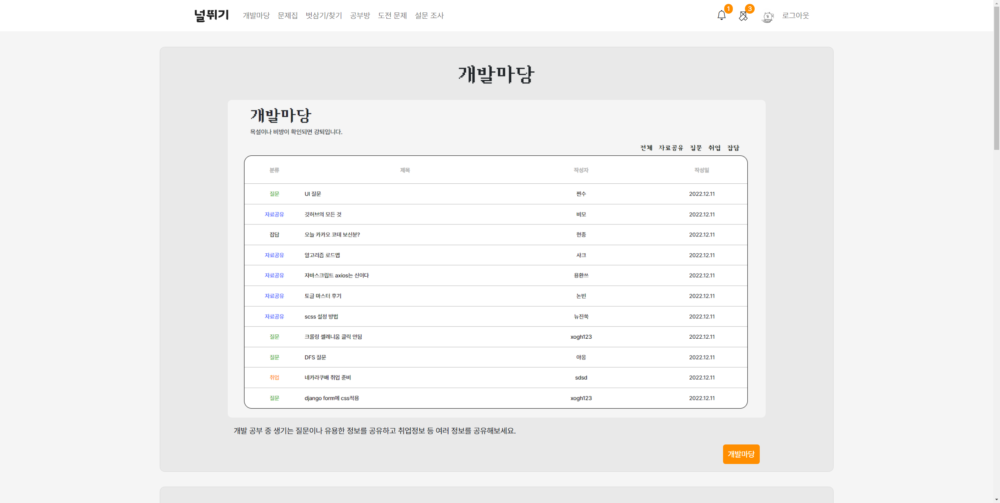

## 널뛰기 프로젝트 소개

- 팀명: 비밀병기
- 주제: 개발자들을 위한 커뮤니티 서비스
- 기획 의도: 여러 개발자들이 모여 함께 성장하는 커뮤니티 개발

## 팀 구성 및 역할

	
최보영

    

        <h5>팀장</h5>
        <h5>백엔드 개발</h5>
        <ul>
            <li>
Accounts 프로필, 팔로우, 방명록
</li>
            <li>
Friends 벗 삼기/찾기
</li>
            <li>
Studies 공부방, 공부방 가입, 공부방 게시판, 알림
</li>
            <li>
Surveys 설문조사 폼 생성, 통계
</li>
        </ul>
    

    
문경욱

    

        <h5>발표</h5>
        <h5>백엔드 개발</h5>
        <ul>
            <li>
Accounts 깃허브/백준 연동
</li>
            <li>
Algorithm 외부 데이터 수집, 문제 검색 기능 설계
</li>
            <li>
Studies 공부방 게시판
</li>
        </ul>
    

    
김수빈

    

        <h5>풀스택 개발</h5>
        <ul>
            <li>
Accounts 프로필, 방명록 화면 설계 및 반응형
</li>
            <li>
Notes 쪽지 기능/알림 구현, 화면 설계 및 반응형
</li>
        </ul>
    

    
황지선

    

        <h5>프론트엔드 개발</h5>
        <ul>
            <li>
Articles 개발마당 화면 설계 및 반응형
</li>
            <li>
Friends 벗삼기/찾기 화면 설계 및 반응형
</li>
            <li>
Studies 공부방 화면 설계 및 반응형
</li>
        </ul>
    

    
안동우

    

        <h5>백엔드 개발</h5>
        <ul>
            <li>
Ariticles 개발마당 게시글, 댓글, 좋아요, 검색 구현
</li>
            <li>
Notes 쪽지 기능 및 알림 구현
</li>
        </ul>
    

    
박태호

    

        <h5>풀스택 개발</h5>
        <ul>
            <li>
메인 페이지 화면 설계 및 반응형
</li>
            <li>
Accounts 회원가입, 로그인 화면 설계 및 반응형
</li>
            <li>
Algorithm 외부 데이터 수집, 화면 설계 및 반응형
</li>
            <li>
Surveys 통계 구현, 화면 설계 및 반응형
</li>
        </ul>
    

## 기술 스택

  	
  	
  	
  	
  	
  	
  	
    
  	
  	
  	
    

## 프로젝트 수행 절차

> 2022.11.17 ~ 12.15

| 구분        | 기간          | 활동                                      | 비고                |
| ----------- | ------------- | ----------------------------------------- | ------------------- |
| 사전 기획   | 11/17 ~ 11/18 | 프로젝트 기획 및 주제 선정                | 아이디어 선정       |
| 데이터 수집 | 11/18 ~ 11/19 | 필요 데이터  및 수집 절차 정의            | 웹 브라우저 활용    |
| 모델링      | 11/19 ~ 11/20 | DB 설계                                   |                     |
| 화면 구성   | 11/25 ~ 12/1  | 화면 설계                                 | Figma를 이용해 구성 |
| 서비스 구축 | 11/20 ~ 12/14 | 모델링과 화면을 바탕으로 실제 서비스 제작 | AWS를 이용해 배포   |

## 주요 기능 소개

1. 회원 관리 (Accounts)

   - 일반 회원가입
     - 아이디, 아이디 중복 확인
     - 비밀번호, 비밀번호 확인
     - 닉네임
     - 백준 아이디, 백준 아이디 유효성 확인
     - 깃허브 아이디, 깃허브 아이디 유효성 확인
   - 깃허브 회원가입
     - 깃허브와 연동
     - 이미 가입되었으면 해당 깃허브 아이디로 로그인
   - 로그인
     - 아이디/비밀번호 오류 메시지 렌더
     - 깃허브 로그인
   - 프로필
     - 사용자 본인일 경우, 회원정보 수정 버튼 렌더
     - 사용자 본인이 아닐 경우, 팔로우 버튼 렌더
     - 팔로잉, 팔로워 목록 모달
     - 쪽지 보내기 기능
     - 방명록
     - 주 사용언어, MBTI, 백준 티어 뱃지
     - 입력한 깃허브 아이디의 Contribution graph
     - 작성 글, 댓글 목록
     - 좋아요한 글 목록
     - 가입한 스터디 목록

   - 방명록
     - 비밀 글 (비동기)
     - 비밀 댓글 (비동기)
     - 페이지네이션

2. 개발마당 (Articles)
   - 게시판
     - 카테고리 별 글 모아보기
     - 게시글 검색
     - 댓글 수, 조회수
     - 페이지네이션
   - 게시글 작성/수정
     - 제목
     - 글의 종류(카테고리): 자료 공유, 취업, 질문, 자유
     - 이미지: 여러 장 선택 가능
     - 내용: 마크다운 문법 가능
   - 게시글 상세 페이지
     - 좋아요 (비동기)
     - 글 수정, 삭제
     - 댓글 (비동기, 마크다운)

3. 문제집 (Algorithm)

   - 키워드 검색

     - 검색창에 문제 번호, 제목, 유형을 입력하여 검색
     - 난이도, 추천 꼬리표와 함께 검색
     - 페이지네이션

   - 난이도 검색
     - 문제의 난이도를 선택한 후 검색
     - 여러 난이도 선택 가능
     - 키워드, 꼬리표와 함께 검색
     - 페이지네이션

   - 추천 꼬리표 검색
     - 문제의 유형(꼬리표)을 선택한 후 검색
     - 여러 꼬리표 선택 가능
     - 키워드, 난이도와 함께 검색
     - 페이지네이션
   - 도전 문제
     - 메인화면에서 선물 상자를 클릭
     - 현재 나의 백준 티어보다 한 단계 높은 문제를 무작위로 추천

4. 벗 삼기/찾기 (Friends)
   - 사용자가 프로필에서 설정한 주 사용언어와 MBTI로 검색 (비동기)
   - 수를 입력해서 조를 구성하면, 그 수만큼 랜덤으로 고른 사용자의 결과를 보여줌
   - 사용자에게 바로 쪽지 보내기 가능

5. 쪽지 (Notes)
   - 작성
     - 받는 사람의 username으로 쪽지 전송
     - 제목과 내용으로 구성
   - 받은 쪽지함
     - 나에게 온 쪽지 목록
     - 읽음, 안읽음 표시
     - 보관 시 보관함으로 이동
     - 삭제 시 휴지통으로 이동
   - 보낸 쪽지함
     - 내가 작성한 쪽지 목록
     - 상대가 읽기 전에 삭제하면, 상대의 쪽지함에서도 삭제 가능
   - 보관함
     - 보관한 쪽지 목록
     - 보관 해제 및 삭제 가능
   - 휴지통
     - 받은 쪽지함에서 삭제
     - 휴지통 복구 가능
     - 여기서 삭제 시 영구적으로 삭제

6. 공부방 (Studies)
   - 스터디 모아보기
     - 카테고리 별 스터디 모아보기
     - 스터디 검색
     - 모집 여부
     - 페이지네이션
   - 스터디 생성/수정
     - 스터디명
     - 스터디 종류(카테고리): 알고리즘, 프론트엔드, 백엔드, 기타
     - 방장 연락처
     - 스터디 인원
     - 이미지: 한 장만 선택 가능
     - 스터디 소개글
   - 스터디 조회
     - 스터디 모집 여부
     - 방장
       - 모집 시작 / 모집 마감 (비동기)
       - 신청 인원 목록 → 승인, 거절 (비동기)
       - 스터디원 목록 → 추방 (비동기)
       - 스터디 공고 삭제, 수정
     - 방장 제외
       - 스터디 가입 신청 / 신청 취소 (비동기)
       - 스터디 탈퇴 (비동기)
   - 스터디용 게시판
     - 카테고리 별 글 모아보기
     - 게시글 검색
     - 댓글 수, 조회수
     - 페이지네이션
   - 게시글 작성/수정
     - 제목
     - 글의 종류(카테고리): 문제, 질문, 자유
     - 문제 번호: 문제 카테고리를 선택 시에만 보이는 필드
     - 내용
   - 게시글 상세 페이지
     - 문제 번호와, 스터디원의 문제 풀이여부를 보여줌 (문제 카테고리)
     - 좋아요 (비동기)
     - 글 수정, 삭제
     - 댓글 (비동기, 마크다운)
   - 스터디 알림
     - 가입 신청, 신청 취소 알림
     - 스터디 가입 승인, 거절 알림
     - 스터디 탈퇴, 추방 알림

7. 설문조사 (Surveys)
   - 개발자 정보에 대한 설문조사 (익명)
   - MBTI, 처음 코딩을 시작한 나이, 개발 경력, 개발 분야 등의 문항
   - 설문 결과를 그래프로 보여줌

## 프로젝트 후 느낀 점